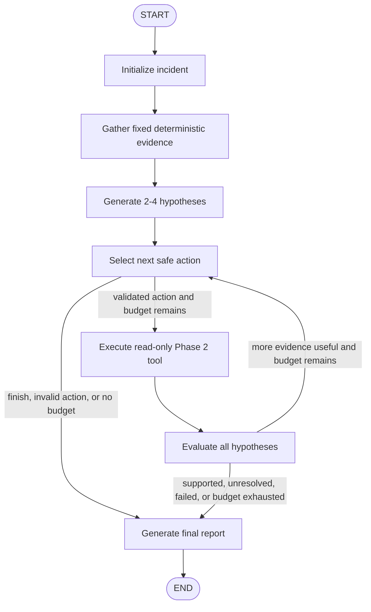

# AI Data Pipeline Incident Investigator

A local-first project that investigates synthetic data-pipeline incidents. It combines deterministic evidence tools with a bounded LangGraph workflow that forms competing hypotheses, selects safe follow-up checks, and produces an auditable report.

All incident data is local and synthetic. Default tests and evaluation require no credentials; an OpenAI-compatible LLM provider is optional for live investigations.

## What the investigator does

Given an incident and scenario directory, the workflow:

1. Gathers pipeline status, source and warehouse comparisons, profiles, metadata, and logs.
2. Generates two to four evidence-cited hypotheses.
3. Selects up to three additional safe, read-only checks.
4. Updates hypotheses as evidence supports, rejects, or leaves them inconclusive.
5. Returns an auditable report with evidence, citations, actions, limitations, and a termination reason.

The included scenarios model an enum mismatch, a required-field null-rate increase, and a missing source partition.

## Investigation workflow



The loop permits at most three additional actions. Deterministic tools create evidence; the LLM only proposes hypotheses, selects from the validated action catalog, and evaluates the collected evidence.


## Quick start

Create an environment and install the project:

```bash
python3 -m venv .venv
.venv/bin/pip install -e ".[dev]"
```

Generate or refresh the synthetic scenarios:

```bash
.venv/bin/python scripts/generate_enum_change_scenario.py
.venv/bin/python scripts/generate_null_rate_increase_scenario.py
.venv/bin/python scripts/generate_missing_partition_scenario.py
```

Run the credential-free test suite:

```bash
.venv/bin/python -m pytest
```

## Run a local evaluation

The default evaluation runs a deterministic static-rule baseline across all scenarios. It scores diagnosis, evidence retrieval, citations, and efficiency against evaluation-only ground truth.

```bash
.venv/bin/python scripts/evaluate_investigator.py --output artifacts/evaluation/static_rules.json
```

The JSON report contains per-scenario and aggregate metrics. Each diagnosis is labeled `correct`, `ambiguous`, `no_diagnosis`, or `incorrect`; only an incorrect asserted cause counts as a false positive. `artifacts/` is ignored by Git.

To evaluate the live workflow, configure a provider and run:

```bash
.venv/bin/python scripts/evaluate_investigator.py --candidate investigator_workflow --output artifacts/evaluation/investigator_workflow.json
```

This opt-in command may contact the configured LLM provider.

## Run a live investigation

Create a local configuration file:

```bash
cp .env.example .env
```

Set `LLM_PROVIDER=openai`, `LLM_MODEL`, and `LLM_API_KEY`. Set `LLM_URL` only for an OpenAI-compatible endpoint.

Run the enum-change demonstration:

```bash
.venv/bin/python scripts/investigate_enum_change.py
```

The script writes workflow logs to standard error and a structured report to standard output. If model configuration or hypothesis processing fails, it returns an honest partial report rather than inventing a diagnosis.

## Example investigation output

Save a live investigation report:

```bash
.venv/bin/python scripts/investigate_enum_change.py \
  > artifacts/investigations/enum_change_report.json
```

A successful enum-change investigation should identify the source-value change, its downstream impact, and cite the deterministic evidence used to support that conclusion:

```json
{
  "incident_id": "enum-change-2026-09-02",
  "likely_cause": "An upstream producer changed `order_status` values from `completed` to `COMPLETE`, which the transformation did not recognize.",
  "impact": "450 records were excluded during transformation, reducing warehouse output from 600 to 150 rows.",
  "findings": [
    {
      "summary": "The incident source introduced 450 `COMPLETE` values while `completed` decreased by 450.",
      "citations": ["E02", "E04"]
    },
    {
      "summary": "Warehouse output fell by 450 rows despite the source row count remaining unchanged.",
      "citations": ["E01", "E03"]
    }
  ],
  "recommended_next_action": "Update or normalize the transformation’s accepted `order_status` enum values.",
  "limitations": []
}
```

The exact wording, hypotheses, and selected follow-up checks can vary by configured model. The full report also includes the raw deterministic evidence records (`E01` through `E06`), investigation trace, and any limitations.

## Important scripts

| Script | Purpose |
|---|---|
| `scripts/generate_enum_change_scenario.py` | Regenerates the upstream enum-mismatch scenario. |
| `scripts/generate_null_rate_increase_scenario.py` | Regenerates the required-field null-rate scenario. |
| `scripts/generate_missing_partition_scenario.py` | Regenerates the incomplete-ingestion scenario. |
| `scripts/investigate_enum_change.py` | Runs one live, provider-backed investigation demonstration. |
| `scripts/evaluate_investigator.py` | Runs local baseline or opt-in workflow evaluation and writes JSON results. |

## Scenario evidence and safety boundary

Every scenario uses the same basic layout:

```text
data/scenarios/<scenario_id>/
├── source/          upstream records before transformation
├── transformed/     records after transformation logic
├── warehouse/       downstream reporting or analytics output
├── metadata/        configuration and run status/counts
├── logs/            structured JSONL pipeline events
├── manifest.json    public scenario inventory and generation details
└── ground_truth/    evaluation-only diagnosis expectations
```

`ground_truth/` is loaded only by the evaluator after a candidate run completes. Agent tools, prompts, graph state, and ordinary investigation reports cannot read it.

## Repository guide

```text
.
├── data/
│   └── scenarios/                 synthetic incident packages and artifacts
├── scripts/                       scenario generators, evaluation runner, and live demo
├── src/
│   └── investigator/
│       ├── agent/                 LangGraph state, nodes, routing, hypotheses, and action validation
│       ├── config/                lazy LLM environment and settings validation
│       ├── evaluation/            evaluation contracts, scoring, baseline, and runner
│       ├── llm/                   provider factory and structured-output prompts
│       ├── models/                shared synthetic scenario data models
│       ├── reporting/             citation-validated reports and investigation traces
│       ├── synthetic/             deterministic scenario generators and helpers
│       └── tools/                 safe local evidence tools for logs, data, metadata, and SQL
├── tests/                         credential-free unit, graph, scenario, and evaluation tests
├── phase_context/                 detailed implementation plans and records
├── PROJECT_CONTEXT.md             project goals and architectural source of truth
├── ROADMAP.md                     high-level milestones
├── pyproject.toml                 package metadata and dependencies
└── .env.example                   names of optional LLM configuration variables
```

## Project boundaries and limitations

- The three scenarios are a small synthetic benchmark, not evidence of production performance.
- Deterministic evidence comes from local tools; live-run hypotheses and conclusions are LLM inferences constrained by citations.
- The workflow permits at most three additional actions and has no write-capable tools, remediation, web UI, API, database, vector store, or external tracing service.
- Provider-backed runs may vary by model and configuration. Default tests and static evaluation remain local and credential-free.
